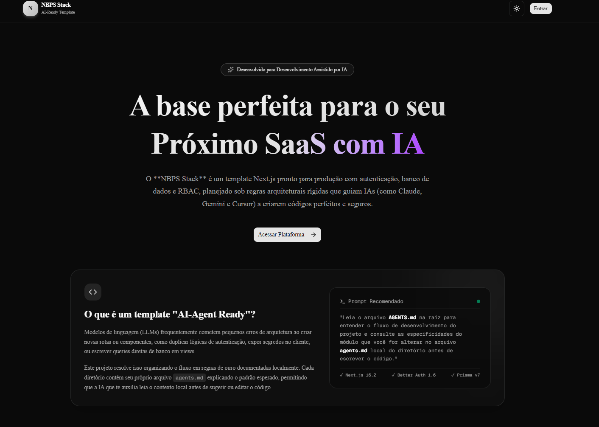

# NBPS Admin Template

<p align="center">
  
  <sub><i>Dica: Tire um screenshot real da tela de login ou do dashboard do seu projeto local rodando e salve como <code>public/screenshot.png</code> para exibi-lo aqui!</i></sub>
</p>

<p align="center">
  
  
  
  
  
  
  
  
</p>

---

## 🎯 O que é o NBPS Admin Template?

O **NBPS Admin Template** é um template de nível de produção para Next.js projetado especificamente para acelerar a criação de painéis administrativos (dashboards) e SaaS. 

Ele nasceu da necessidade de padronizar fluxos repetitivos e sensíveis de desenvolvimento, garantindo:
1. **Autenticação Segura:** Fluxos completos (Login, Registro, Recuperação e Redefinição de Senha, Verificação de E-mail) prontos para uso através do **Better Auth**.
2. **Controle de Acesso Robusto (RBAC):** Painel administrativo integrado para gestão de usuários, papéis (roles) e permissões.
3. **Padrões de Segurança Elevados:** Proteção contra SQL injection, vazamento de chaves privadas e execução inadequada de mutations no cliente.
4. **Pronto para IAs (AI-Agent Ready):** Arquitetura estruturada com arquivos `agents.md` individuais por módulo, instruindo inteligências artificiais (como Cursor, Claude, Gemini e Copilot) a seguirem fielmente as regras e convenções do projeto.

---

## 🛠️ Stack Tecnológica

| Camada | Tecnologia | Versão | Descrição |
|:---|:---|:---:|:---|
| **Framework** | [Next.js](https://nextjs.org) | `16.2` | App Router com suporte a Turbopack e Server Actions |
| **Runtime** | [React](https://react.dev) | `19.2` | Componentização baseada em Server Components por padrão |
| **Linguagem** | [TypeScript](https://www.typescriptlang.org) | `5.x` | Tipagem estática rigorosa em todo o fluxo de dados |
| **Estilização** | [Tailwind CSS](https://tailwindcss.com) | `v4` | Design moderno e performance otimizada (@theme inline) |
| **Componentes** | [Shadcn/UI](https://ui.shadcn.com) | `4.x` | Componentes de interface premium e totalmente acessíveis |
| **Lint/Format** | [Biome](https://biomejs.dev) | `2.2` | Formatação e análise estática ultra rápida (substituindo ESLint/Prettier) |
| **Banco de Dados** | [PostgreSQL](https://www.postgresql.org) + [Prisma](https://www.prisma.io) | `7.8` | Modelagem robusta de dados e suporte a transações ACID |
| **Autenticação** | [Better Auth](https://better-auth.com) | `1.6` | Sistema de autenticação moderno + Admin Plugin nativo |
| **Validação** | [Zod](https://zod.dev) + [React Hook Form](https://react-hook-form.com) | — | Validação dupla (UX no cliente + segurança estrita no servidor) |
| **Tabelas** | [TanStack Table](https://tanstack.com/table) + [nuqs](https://nuqs.dev) | — | Paginação, filtros e ordenação server-side sincronizados na URL |

---

## ⚡ Início Rápido (Quick Start)

Siga os passos abaixo para ter o ambiente local funcionando em menos de 5 minutos:

### 1. Clonar e Instalar Dependências
Este projeto utiliza o **pnpm** como gerenciador de pacotes padrão devido ao arquivo `pnpm-lock.yaml`.

```bash
# Instalar os pacotes necessários
pnpm install
```

### 2. Configurar o Banco de Dados (Docker)
O template vem com um arquivo `docker-compose.yml` pré-configurado na porta `5433` para evitar conflito com instâncias locais do PostgreSQL.
```bash
# Subir o container em segundo plano
docker compose up -d
```

### 3. Configurar as Variáveis de Ambiente
Crie o arquivo `.env` baseado no exemplo fornecido:
```bash
cp .env.example .env
```
Abra o arquivo `.env` e preencha as variáveis:
- Gere um segredo de autenticação rodando: `pnpm dlx auth secret` e adicione em `BETTER_AUTH_SECRET`.
- Defina o e-mail e senha iniciais do administrador (`ADMIN_EMAIL` e `ADMIN_PASSWORD`).

### 4. Executar as Migrations e Gerar o Client
```bash
# Executa as migrations do Prisma no banco local
pnpm prisma migrate dev

# Gera os tipos atualizados do Prisma Client
pnpm prisma generate
```

### 5. Alimentar o Banco de Dados (Seed)
Crie a conta do primeiro usuário administrador do sistema:
```bash
pnpm prisma db seed
# ou pelo script de atalho: pnpm db:seed
```

### 6. Iniciar o Servidor de Desenvolvimento
```bash
pnpm dev
```

Acesse [http://localhost:3000](http://localhost:3000) e utilize as credenciais do admin configuradas no `.env` para logar.

---

## ⚙️ Variáveis de Ambiente

O arquivo `.env` contém as configurações principais do sistema. Os dados confidenciais do servidor são blindados e validados em runtime pelo `@t3-oss/env-nextjs` no arquivo `src/env.ts`.

### Configurações de E-mail (SMTP / Console)

O NBPS Admin Template possui um sistema flexível de envio de e-mails. Se nenhuma variável SMTP estiver preenchida, o sistema entra em modo de console e apenas printa as mensagens no terminal (ideal para desenvolvimento).

| Variável | Obrigatória | Descrição |
|:---|:---:|:---|
| `SMTP_HOST` | Não | Se preenchido, ativa o envio real via SMTP. Se vazio, loga o e-mail em formato JSON no stdout (console). |
| `SMTP_PORT` | Apenas se SMTP ativo | Porta SMTP (ex: `465` para SSL, `587` ou `2525` para TLS). |
| `SMTP_USER` | Apenas se SMTP ativo | Nome de usuário da conta de e-mail. |
| `SMTP_PASSWORD` | Apenas se SMTP ativo | Senha de aplicativo ou token do provedor SMTP. |
| `EMAIL_FROM` | Não | Remetente. Padrão: `SMTP_USER` ou `no-reply@localhost` em desenvolvimento. |
| `EMAIL_FROM_NAME` | Não | Nome de exibição do remetente. Padrão: `NBPS Admin Template`. |

---

## 🏛️ Estrutura de Diretórios e Arquitetura

O projeto adota uma arquitetura modular focada em responsabilidade única e previsibilidade:

```
src/
├── app/             # Rotas, Layouts e APIs (Next.js 16 App Router)
├── components/      # Componentes visuais
│   ├── ui/          # Componentes primitivos (Shadcn/UI - livres de lint)
│   ├── data-table/  # Estruturas para tabelas dinâmicas server-side
│   └── sidebar/     # Menu lateral colapsável com controle de permissões
├── actions/         # Server Actions (camada de transporte de rede)
├── validations/     # Esquemas de validação Zod (Single Source of Truth)
├── lib/             # Utilitários, conexões e configurações de terceiros
│   ├── db/          # Conexão singleton com Prisma e Driver Adapter
│   ├── auth/        # Configuração do Better Auth e controle de permissões (RBAC)
│   └── errors/      # Tratamento unificado de erros com ActionResponse
```

### Princípios de Design de Código (Golden Rules)

*   **Um arquivo, uma responsabilidade:** Cada ação do servidor ou componente deve viver em seu próprio arquivo nominativo, facilitando revisões de pull request e entendimento de código (ex: `create-user.action.ts`).
*   **Tratamento de Erros Seguro:** Ações do servidor nunca lançam erros globais diretamente para o cliente. Elas envelopam respostas com o contrato `{ success: true, data }` ou `{ success: false, error }`, mascarando erros internos do banco de dados com códigos previsíveis.
*   **Segurança Dupla (Server-Side First):** 
    *   *No Servidor (Segurança Real):* Toda Server Action privada **DEVE** utilizar o wrapper `protectedAction` para validação da sessão e checagem de permissões via matriz RBAC.
    *   *No Cliente (UX):* Botões e acessos a rotas são desabilitados baseados no estado da sessão síncrona na memória do cliente. A segurança do front-end é apenas visual, a verdadeira segurança ocorre na action do servidor.
*   **Ações e Leituras de Banco:** JAMAIS execute chamadas como `prisma.*` em páginas (`page.tsx`) ou componentes. Toda leitura e escrita passa obrigatoriamente por uma Server Action (`.action.ts`).

---

## 🤖 AI-Agent Ready (Otimizado para Inteligência Artificial)

O NBPS Admin Template foi desenvolvido pensando nas limitações das IAs de escrita de código (como perda de contexto e duplicação de funções). O repositório contém documentações técnicas estruturadas chamadas `agents.md` localizadas em cada módulo chave do sistema.

### Como usar?
Sempre que for instruir sua IA para programar novas features neste projeto, utilize o seguinte prompt ou ensine ela a ler as instruções:

> *"Leia o arquivo `AGENTS.md` na raiz para entender o fluxo de desenvolvimento do projeto e consulte as especificidades do módulo que você for alterar no arquivo `agents.md` local do diretório antes de escrever o código."*

### Lista de Guias Disponíveis:

| Módulo | Caminho da Instrução | Cobertura de Conteúdo |
|:---|:---|:---|
| **Regras Globais** | [AGENTS.md](./AGENTS.md) | Regras de ouro da arquitetura, stack de tecnologia e commit flow. |
| **Banco de Dados** | `src/lib/db/agents.md` | Padrão Singleton, Driver Adapter, migrations e seeds. |
| **Autenticação** | `src/lib/auth/agents.md` | Setup do Better Auth, RBAC e uso do Wrapper `protectedAction`. |
| **E-mail** | `src/lib/email/agents.md` | Configuração Nodemailer, React-Email e templates de envio. |
| **Erros** | `src/lib/errors/agents.md` | Padrão de respostas de rede e tratamento de falhas. |
| **Actions** | `src/actions/agents.md` | Implementação de Server Actions e regras de validação. |
| **Componentes** | `src/components/agents.md` | Tabelas TanStack, Shadcn/UI e estilização com Tailwind v4. |
| **Proxy** | `src/proxy.ts` | Entendimento de rotas protegidas usando proxy nativo Next.js 16. |

---

## 📜 Licença (License)

Este projeto está licenciado sob a **Licença MIT** - consulte o arquivo [LICENSE](./LICENSE) para obter detalhes.

### O que isso significa na prática?
A licença MIT é uma das licenças mais permissivas e populares do ecossistema open-source. Com ela, você pode:
*   **Uso Comercial:** Utilizar este template para criar produtos proprietários e SaaS com fins lucrativos.
*   **Modificação:** Alterar qualquer linha de código para se adaptar às suas necessidades.
*   **Distribuição:** Compartilhar o código original ou modificado com quem quiser.
*   **Uso Privado:** Manter suas modificações em repositórios privados sem necessidade de abrir o código-fonte final.

A única condição é que o aviso de direitos autorais e a permissão contidos no arquivo `LICENSE` original sejam incluídos em todas as cópias ou partes substanciais do software.
