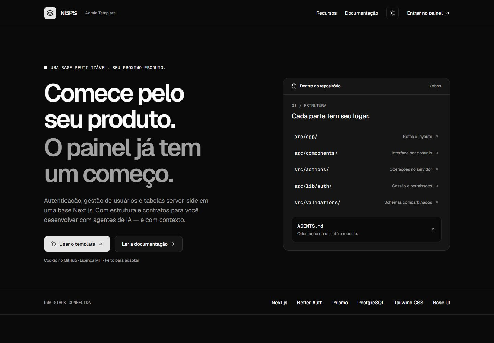

# NBPS Admin Template

**Start with your product instead of rebuilding the admin panel.**

NBPS is an agent-ready Next.js template for projects that need authentication, user administration, a protected dashboard, and server-side tables. It is a reusable starting point for developers building internal tools and application back offices.

The agent-ready part is concrete: modular code, hierarchical `AGENTS.md` guides, shared validation and authorization contracts, reference implementations, tests, and a review workflow. These give developers and coding agents a common set of rules; they do not prevent every mistake.

[Use this template](https://github.com/new?template_name=nbps-admin-template&template_owner=LuPeBreak) · [Repository](https://github.com/LuPeBreak/nbps-admin-template) · [Quick Start](#quick-start) · [Architecture](#architecture) · [Working with agents](#working-with-agents)



The public Home, captured from a local production build. Derived projects can replace its presentation.

## Included scope

| Area | Available today |
| --- | --- |
| Authentication | Email/password sign-in, sign-out, password reset request and reset forms, and session-aware route protection through Better Auth. |
| User administration | Paginated user list, account creation, name/role editing, ban/unban, and deletion with additional server-side domain restrictions. Roles are the configured `admin` and `user` values. |
| Profile | Update the current user's name and password through native Better Auth methods. |
| Tables | Server-side search, filtering, sorting, pagination, URL state, and column visibility controls. |
| UI | Public Home, dashboard shell, forms and dialogs, semantic theme tokens, and light/dark theme support. Application and email copy is Portuguese (PT-BR). |
| Email | React Email templates for welcome and password reset messages, with SMTP or a local JSON transport. |
| Development | TypeScript, Zod, React Hook Form, Vitest, Biome, CI, and module-specific agent instructions. |

The template does not include billing, tenancy, business modules, dynamic role/permission management, or an embedded AI product. It is not a complete SaaS or a certification of production readiness. See [Known limitations](#known-limitations) before adopting it.

## Stack

Declared dependency requirements come from [package.json](./package.json); resolved versions below come from the root importer in [pnpm-lock.yaml](./pnpm-lock.yaml). A range such as `^1.6.11` is not the installed version.

| Technology | Declared | Lockfile resolution |
| --- | --- | --- |
| Next.js | `16.2.6` | `16.2.6` |
| React / React DOM | `19.2.4` | `19.2.4` |
| TypeScript | `^5` | `5.9.3` |
| Tailwind CSS | `^4` | `4.3.2` |
| Base UI (`@base-ui/react`) | `^1.4.1` | `1.6.0` |
| Prisma CLI / client / PostgreSQL adapter | `^7.8.0` | `7.8.0` |
| Better Auth | `^1.6.11` | `1.6.23` |
| Zod | `^4.4.3` | `4.4.3` |
| React Hook Form | `^7.75.0` | `7.81.0` |
| TanStack React Table | `^8.21.3` | `8.21.3` |
| nuqs | `^2.8.9` | `2.9.0` |
| Nodemailer | `^9.0.1` | `9.0.3` |
| Vitest | `^4.1.10` | `4.1.10` |
| Biome | `2.2.0` | `2.2.0` |

UI components live in `src/components/ui/`, following shadcn/ui conventions with the `base-nova` style configured in [components.json](./components.json) and Base UI primitives where applicable. The `shadcn` package is tooling, not a version of the copied component source. Local PostgreSQL uses the `postgres:17-alpine` image in [docker-compose.yml](./docker-compose.yml), separately from the JavaScript lockfile.

## Quick Start

### 1. Prepare the checkout

You need Git, Docker with Compose (or an existing PostgreSQL database), and a Node.js release compatible with the locked packages. Prisma 7.8 declares `^20.19 || ^22.12 || >=24.0`. The [CI workflow](./.github/workflows/ci.yml) uses Node.js 20 and pnpm `10.30.1`; use that pnpm version to reproduce its install.

Create your own repository with [Use this template](https://github.com/new?template_name=nbps-admin-template&template_owner=LuPeBreak), then clone it. To inspect the original instead:

```sh
git clone https://github.com/LuPeBreak/nbps-admin-template.git
cd nbps-admin-template
pnpm install --frozen-lockfile
```

### 2. Configure the environment

Copy [.env.example](./.env.example) to `.env` (`cp .env.example .env` in a POSIX shell, or `Copy-Item .env.example .env` in PowerShell), then edit it locally:

| Variable | Local setup |
| --- | --- |
| `DATABASE_URL` | The example connects to the supplied Compose database on `localhost:5433`, database `nbps_dev`. Change it if using another database. |
| `BETTER_AUTH_SECRET` | Replace the placeholder with a random secret of at least 32 characters. |
| `BETTER_AUTH_URL` | Keep `http://localhost:3000` for the default local server. |
| `ADMIN_EMAIL` / `ADMIN_PASSWORD` | Set the initial admin's email and password. Environment validation requires a valid email and a password of at least 8 characters. |
| `SMTP_HOST` | Leave empty to start without email delivery. See [Email configuration](#email-configuration) for the exact behavior. |
| `EMAIL_FROM` | **Remove or comment out the empty `EMAIL_FROM=""` line in the example**, or supply a valid sender email. The current `z.email().optional()` schema accepts an omitted value, but rejects an empty string. |

Generate the auth secret locally with Node's built-in crypto module:

```sh
node -e "console.log(require('node:crypto').randomBytes(32).toString('hex'))"
```

Store the result only in your local environment or secret manager. Do not commit `.env` or paste secrets, credentials, reset links, or full environment dumps into issues, agent prompts, or reports. [src/env.ts](./src/env.ts) validates server configuration and has an empty client configuration block. Leave `SKIP_ENV_VALIDATION` unset for normal setup; it is not a fix for missing configuration.

### 3. Start the database and apply existing migrations

For the supplied local database:

```sh
docker compose up -d
```

Compose maps host port `5433` to PostgreSQL port `5432` and stores data in the `pgdata` volume. Its example credentials are for local development. If you already have PostgreSQL configured, skip Compose and confirm that `DATABASE_URL` points to your intended database before the next commands.

```sh
pnpm exec prisma migrate deploy
pnpm exec prisma generate
pnpm db:seed
```

`migrate deploy` applies committed migrations; it does not create a migration. `generate` writes the ignored client to `src/lib/db/generated/`. The URL, schema, migration directory, and Prisma seed command are configured in [prisma.config.ts](./prisma.config.ts).

The [seed](./prisma/seed.ts) creates an admin through Better Auth and marks that new account's email as verified. **If any account already exists with `ADMIN_EMAIL`, the seed exits without changing it.** Changing `ADMIN_PASSWORD` and rerunning the seed does not rotate its password, promote its role, or repair its verification state.

When intentionally changing the schema in a derived project, use `pnpm exec prisma migrate dev --name <descriptive_name>` against a development database to create and apply a new migration, then regenerate the client. This is separate from installing the existing template. See the [database guide](./src/lib/db/AGENTS.md).

### 4. Run the application

```sh
pnpm dev
```

Open [the local Home](http://localhost:3000), then [sign in](http://localhost:3000/sign-in) with the newly seeded admin's credentials. User management is at `/dashboard/admin/users`.

For a local production build, run `pnpm build` followed by `pnpm start`. This does not apply migrations or configure a deployment. The public Home can be replaced by a derived project's own presentation.

## Email configuration

Behavior is defined by [src/lib/email/mailer.ts](./src/lib/email/mailer.ts):

| Configuration | Behavior |
| --- | --- |
| `SMTP_HOST` empty or omitted | Nodemailer's JSON transport captures the message without sending it. Outside production, the terminal logs only recipient, subject, and message ID. Bodies and reset links are not printed. In production this mode still sends nothing and does not emit those metadata logs. |
| `SMTP_HOST` populated | Uses SMTP and requires a nonzero `SMTP_PORT`. Authentication is supplied only when `SMTP_USER` is populated; then `SMTP_PASSWORD` is required. |
| `EMAIL_FROM` provided | Uses that valid email as the sender address. Omit the variable rather than assigning an empty string. |
| `EMAIL_FROM` omitted | Falls back to `SMTP_USER` in SMTP mode when present, otherwise `no-reply@localhost`. |
| `EMAIL_FROM_NAME` | Sender display name; defaults to `NBPS Admin Template`. |

The example uses port `587`. The mailer leaves `secure` to Nodemailer's port-based default (`465` for implicit TLS); it does not read `SMTP_SECURE`. Match configuration to your provider.

Console mode is enough to start the application, but does not let you complete a reset from a logged link. Use a configured SMTP provider or local SMTP inbox to exercise email flows. Transport acceptance does not prove that a recipient mailbox exists or delivery succeeded. The [email guide](./src/lib/email/AGENTS.md) documents extension points.

## Architecture

| Location | Responsibility |
| --- | --- |
| [src/app/](./src/app) | App Router pages, layouts, API entrypoints, and route-specific Server Component orchestration. |
| [src/components/](./src/components) | Reusable presentation, interactive forms, dialogs, dashboard/sidebar UI, and domain components. |
| [src/components/data-table/](./src/components/data-table) | Generic renderer, pagination, sorting controls, URL parsers, and View Options. |
| [src/components/users/](./src/components/users) | User DTO, columns, filters, and row actions. |
| [src/actions/](./src/actions) | Custom Server Actions for queries and domain-specific operations. |
| [src/validations/](./src/validations) | Zod schemas and derived input types. |
| [src/lib/auth/](./src/lib/auth) | Better Auth configuration, shared roles/capabilities, `requireSession`, and `protectedAction`. |
| [src/lib/actions/](./src/lib/actions) / [src/lib/errors/](./src/lib/errors) | Input/error helpers and the `ActionResponse` contract. |
| [src/lib/db/](./src/lib/db) / [prisma/](./prisma) | Prisma adapter/client, schema, migrations, and seed. |
| [src/lib/email/](./src/lib/email) | Mail transport, rendering, and templates. |
| [src/proxy.ts](./src/proxy.ts) | Session-aware route gate using Next.js Proxy (Node.js runtime by default). |

Application runtime `prisma.*` calls belong in `.action.ts` files. Server-only infrastructure such as auth adapter configuration and the seed is an explicit exception. Pages compose actions and components; they do not query Prisma directly. Shared modules use named exports, and index files re-export symbols without business logic.

Custom actions validate untrusted input on the server with Zod through `validateInput`. Forms use React Hook Form and schemas for client feedback. Client validation is a convenience; it does not replace server validation.

Native Better Auth methods handle their own endpoints, validation, and authorization. UI calls them for profile changes and supported admin operations. NBPS custom actions add its list query, welcome email operation, and domain restrictions around deletion. Avoid duplicating native endpoints behind custom wrappers.

`ActionResponse<T>` describes handled custom-action results. `validateInput` formats validation failures, and `actionError` maps caught failures to a safe client response. This is not a universal exception boundary: `protectedAction` does not catch rejected session lookups or exceptions thrown by callbacks, and native Better Auth responses use their own contract.

## Authorization

### Capability requests

The catalog and types in [permissions.ts](./src/lib/auth/permissions.ts) derive from Better Auth's Admin plugin statements. A simple `PermissionRequest` means **AND** across every action and resource. NBPS `anyOf` means **OR between complete AND requests**:

```ts
import {
  hasPermission,
  type PermissionRequest,
  type PermissionRequirement,
} from "@/lib/auth/permissions";

const editAndAssignRole = {
  user: ["update", "set-role"],
} satisfies PermissionRequest;

const listUsersOrRevokeSessions = {
  anyOf: [{ user: ["list"] }, { session: ["revoke"] }],
} satisfies PermissionRequirement;

hasPermission("admin", editAndAssignRole);
hasPermission("admin", listUsersOrRevokeSessions);
```

Evaluation is synchronous and uses the configured role's native `authorize(request).success` API. It does not perform a network lookup. Unknown roles, empty requirements, malformed alternatives, and unsupported permissions are denied. `anyOf` is NBPS composition, not a native Better Auth client payload.

### Server authority and validated sessions

Protect a server page with a requirement selected in server code:

```ts
import { requireSession } from "@/lib/auth/require-session";

const session = await requireSession({ user: ["list"] });
// session.user.role is validated against the configured Prisma roles.
```

`requireSession()` requires a valid session and role without adding a capability requirement. Missing sessions redirect to `/sign-in`, invalid roles to public `/`, and valid roles lacking a capability to `/dashboard`. Home stays public, including when a session exists; it is the safe destination for invalid roles.

For custom actions, `protectedAction(requirement, callback)` fetches the session once, validates role and capabilities, and invokes **`callback(session, ...originalArgs)`**. The client supplies only the original action arguments, never the trusted session or permission requirement.

The concrete reference is [deleteUserAction](./src/actions/delete-user.action.ts): its callback receives `(session, input: unknown)`, validates `input` with `DeleteUserSchema`, rejects self-deletion using `session.user.id`, reads the target on the server, rejects admin-account deletion, then invokes Better Auth's removal API. Reuse this complete pattern when adding domain restrictions.

Capability checks do not establish ownership. If a derived domain introduces own/any permissions, server logic must evaluate `canUpdateAny || (canUpdateOwn && targetOwnerId === session.user.id)` using an owner ID loaded from trusted server data before the restricted operation. NBPS currently defines no own permissions.

### Client checks are UX

Client components use the synchronous native check to hide or disable controls. The existing create-user form submits a role, so its button requires both capabilities:

```ts
import { authClient } from "@/lib/auth/auth-client";
import type { Role } from "@/lib/db/generated/enums";

function canShowCreateUser(role: Role) {
  return authClient.admin.checkRolePermission({
    role,
    permissions: { user: ["create", "set-role"] },
  });
}
```

For OR in the UI, call `checkRolePermission` for each simple request and combine results with `.some(...)`. These checks do not replace server authorization. Protected pages pass validated role/user context into permission-sensitive components so the initial render does not depend on a later session-hook update.

One role per user (`user` or `admin`) is the current schema and session baseline, not a permanent ban on multi-role support. A derived project can change it when required, with coordinated persistence, typing, authorization, and test updates. Comma-separated roles are unsupported in the current baseline. Follow the [auth guide](./src/lib/auth/AGENTS.md) and [action guide](./src/actions/AGENTS.md).

## DataTable pattern

Use the [users page](./src/app/dashboard/admin/users/page.tsx) and [listUsersAction](./src/actions/list-users.action.ts) as the working reference. Filtering, sorting, counting, and paging happen on the server; the client receives only the requested rows. The generic TanStack renderer uses manual pagination, filtering, and sorting.

To add a table, keep these parts together in its domain:

1. A neutral row DTO such as [users-table-types.ts](./src/components/users/users-table-types.ts), shared by columns, dialogs, and actions.
2. [URL parsers](./src/components/users/users-search-params.ts), [columns](./src/components/users/users-data-table-columns.tsx), a [toolbar](./src/components/users/users-data-table-toolbar.tsx), and [row actions](./src/components/users/users-data-table-row-actions.tsx).
3. A validated and authorized `.action.ts` query with an explicit search contract, sorting allowlist, minimal selected fields, counts, and the effective page.
4. A Server Component route that awaits `searchParams`, parses them with nuqs, calls the action, canonicalizes a mismatched page, and supplies generic `DataTable` slots and stable permission metadata.

The generic table accepts `toolbar` for search/filters and `tableActions` for primary domain controls. Keep domain queries, labels, permissions, and mutations out of `src/components/data-table/`.

The users reference has these bounds and behaviors:

- Search matches name or email, independently of visible columns. Text is limited to 100 characters and normalized before writing URL state.
- Page size defaults to 15; the server permits 1–100 rows and bounds page numbers to 100,000. The UI offers 10, 15, 20, 30, 40, or 50 rows. Sort fields are `name`, `email`, `role`, and `createdAt`, with `asc`/`desc` directions; the default is creation time descending.
- Search, role, order, page, and page size live in the URL. Filter, sort, and page-size changes reset `page` to 1 in the same transition. Discrete navigation uses push history; debounced typing uses replacement history.
- An out-of-range result is recovered by the action, which returns the effective page. The route uses a guarded replacement redirect so URL, rows, labels, and controls agree, including for empty results.
- View Options (`Colunas`) only lists hideable columns with an explicit domain `meta.label`. Action columns disable hiding. Visibility is local component state; it is not saved to the URL or across reloads and does not change query semantics.

See the [DataTable guide](./src/components/data-table/AGENTS.md) for extension contracts and [Known limitations](#known-limitations) for remaining UI behavior.

## Working with agents

Start with [AGENTS.md](./AGENTS.md), then read **every applicable guide along the target file's path**, from the root through each intermediate directory to the nearest guide. The root module index helps navigation; it does not replace that chain.

A useful task prompt is:

> Read the applicable AGENTS.md chain and inspect the existing reference implementation before editing. Implement one complete feature slice using the installed stack and shared contracts. Run relevant read-only checks and tests, inspect the diff, and report verification, omissions, and final Git state. Keep UI copy in PT-BR and code, comments, documentation, and commits in English.

Use [deleteUserAction](./src/actions/delete-user.action.ts) for contextual authorization, the [users page](./src/app/dashboard/admin/users/page.tsx) for server-side tables, and [CreateUsersButton](./src/components/users/create-user-button.tsx) for permission-sensitive UI. Read the corresponding [validation](./src/validations/AGENTS.md), [components](./src/components/AGENTS.md), and [routing](./src/app/AGENTS.md) guides before adapting them. For Next.js changes, consult the versioned guides in `node_modules/next/dist/docs/`.

The workflow uses one feature branch and one verified slice per PR, with squash integration into `main`. Coherent checkpoint commits are permitted during authorized work; push/opening a PR, marking it ready, and squash-merging each require explicit human authorization against the current full diff. Instructions, tests, and independent review support judgment; they do not replace it. Durable contract changes belong in the owning guide, not an implementation diary.

## Tests and verification

Run from the repository root after installing dependencies, configuring the environment, and generating the Prisma client:

```sh
pnpm test
pnpm typecheck
pnpm lint
pnpm build
git diff --check
```

`pnpm test:watch` is available for focused work. `pnpm lint` is a read-only Biome check; `pnpm format` and `pnpm check` rewrite selected files and are fixers, not verification commands. Inspect their diff if you intentionally use them. `pnpm build` creates ignored output and can execute environment-dependent code.

The Vitest suite uses the Node environment and covers permission semantics with the native role engine, authorization/session contracts with mocked boundaries, auth plugin wiring, Proxy routing, Zod inputs, action helpers, URL parser/search limits, pagination calculations, user utilities, and a targeted server-rendered create-button check. It is not a complete browser, database integration, SMTP, or E2E suite; passing it is not a coverage percentage or proof that every flow works.

[CI](./.github/workflows/ci.yml) installs with the frozen lockfile, generates Prisma, and runs tests, lint, typecheck, and build for pushes and PRs targeting `main` or `development`. It does not provision PostgreSQL, apply migrations, seed an admin, or validate live mail delivery. Add behavior-specific tests and focused manual checks as each derived product grows.

## Known limitations

- The dashboard/sidebar mobile experience still needs work. Light/dark styles and responsive components do not amount to a complete accessibility or device audit.
- Certain mutations may leave a stale table row until the view is refreshed. Recheck invalidation and refresh behavior when extending those flows.
- Browser Back can show a cached protected-page snapshot after logout; direct access and reload remain protected. A browser snapshot is separate from authorization for a fresh server request.
- There is no signup screen. Email/password signup is not explicitly disabled in the Better Auth configuration; missing UI does not imply the native endpoint is blocked. Decide the registration policy for a derived product.
- `/verify-email-success` is a presentation page. A complete verification-email sending and enforcement journey is not configured. The seed's verified admin is not evidence of that journey.
- Roles are statically configured, and billing, tenancy, business workflows, and a full E2E/browser suite remain outside this baseline. Review authentication policy, infrastructure, delivery, and operational requirements for your deployment.

## License

[MIT](./LICENSE). Retain the copyright and permission notice in copies or substantial portions of the software. The license includes its existing warranty disclaimer.
